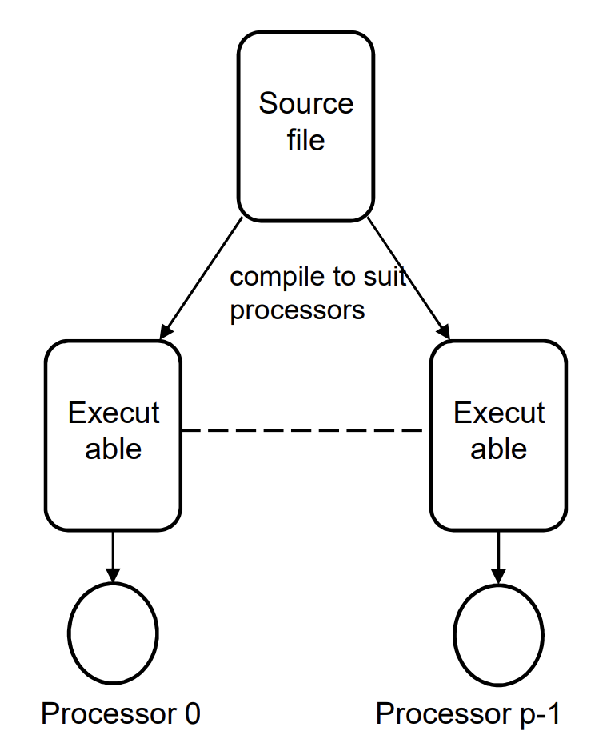
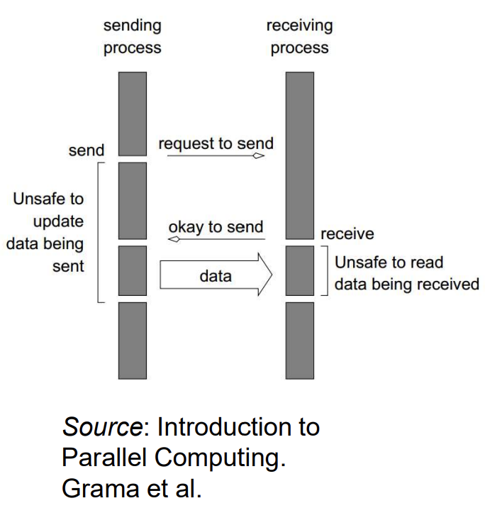
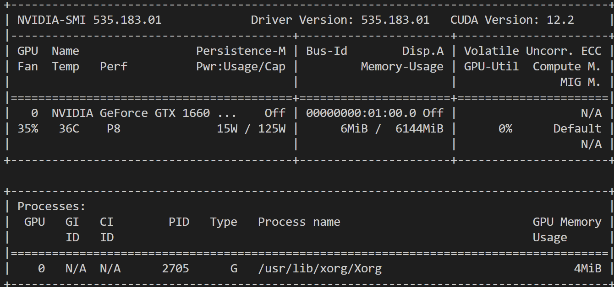
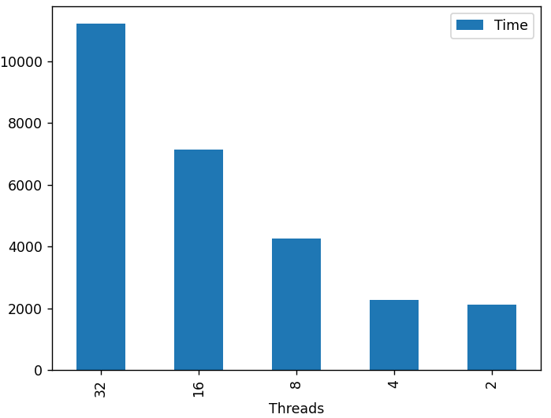
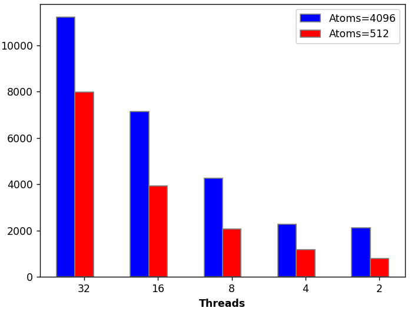
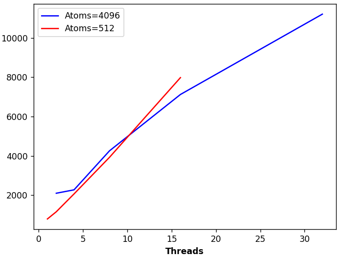

# HPC比赛教程

作者：[HenryZ16](https://github.com/HenryZ16)，[Ayanokoji-li](https://github.com/Ayanokoji-li)

<h2 id="0">0. 开始</h2>

### 基础内容
本教程默认你已经学会了部分基础操作，包括但不限于：shell、编辑器(Vim)、VSCode的配置、远程连接(SSH)等。如果你对这些感到陌生，请阅读：

- [linux-checklist](https://github.com/plctlab/weloveinterns/blob/master/archives/capabilities/linux-checklist.md) from PLCT Lab
- [计算机教育中缺失的一课](https://missing-semester-cn.github.io/)

初次阅读时，你不需要尝试完全记住参考资料中的所有内容，而是对其有一个大致了解。当你在后续章节中需要进行某项操作时，你就可以快速找到对应内容。一开始时，你可能会因为反复查阅而感到痛苦。但是假以时日，你的相应技能会愈发熟练。此外，询问AI也是一个不错的选择，你可以对不理解的知识点深入提问。

本教程也是如此。在以下章节中，你将会从[编译](#1)、[运行](#2)、[优化](#3)三个方面逐层深入了解HPC比赛所需的各项技能。你不需要在初次接触到这些知识时就要对其了如指掌，而是你了解你在比赛中需要干什么。在完成配套的练习时，再回到每个阶段查阅相关信息。这样，才能做到 “边做边学” 。

Geekpie_HPC提供了[HPC Wiki](https://hpc.geekpie.club/wiki/index.html)，供你在知道某些概念，但是需要深入了解，或是查看往年比赛题目时使用。

*看到标了**TODO**的，请鞭策作者尽快完成（*

### Copilot

*没有装Copilot的不准进205!!!*

Github Copilot是一个辅助代码AI工具。我们强烈要求读到这句话（和斜体的那句话）的读者在Github上开通学生认证，并在VSCode中安装Copilot。不要问为什么，先弄好再说。

### 装机（适用于线下比赛）

**NOTE**：*看起来一时半会不用讲这个了，毕竟没拿到SC - SCC。你可以先看看已经写好的文字内容*

*推荐图拉丁吧*

装机是参加线下HPC比赛的必备技能之一，它包括：
- 组装硬件。你至少需要学会如何拆卸并重新组装一台电脑。你可以尝试先拿自己的电脑练练手，比如拆开清灰等。你需要一个小盒子，来装你拆下来的小零件比如螺丝等。
- 安装系统。如果存储空间充足，你可以尝试在自己的电脑上安装ubuntu LTS系统。在熟悉linux系统之后，你甚至可以重新安装一个只有控制台的服务器版本的ubuntu。
- 系统配置。**TODO**

### 体系结构

你可以从软件和硬件两个方面去认识一台计算机：

软件方面，让机器按照一定逻辑运行的一些指令。因此，操作系统（[OS](https://en.wikipedia.org/wiki/Operating_system), Operating System）、用户程序等都可以被视作软件。其中，操作系统是直接运行在硬件层面上的软件，而用户程序则需要操作系统提供的与硬件交互的接口来运行。

硬件方面，现代计算机的架构通常采用 [von Neumann architecture](https://en.wikipedia.org/wiki/Von_Neumann_architecture)。这样的计算机由5个部分组成：

- 处理器单元：包含若干个寄存器，进行算术运算
- 控制单元：包含指令寄存器和程序计数器（program counter）
- 内存（memory）：包括CPU或其他处理器中的缓存（[cache](https://en.wikipedia.org/wiki/Cache_(computing))），主存（main memory）和缓存内存（cache memory，Linux 下通常放在swap分区）等
- 外存（storage）：包括被当做硬盘使用的内存（[tmpfs](https://www.kernel.org/doc/html/latest/filesystems/tmpfs.html)）、硬盘、网络硬盘等
- 输入输出（I/O）：既包括人机交互的设备，也包含诸如网络通信等能与其他计算机沟通的设备

指令集架构（[ISA](https://en.wikipedia.org/wiki/Instruction_set_architecture), Instruction Set）是连接软件和硬件的桥梁。编译器将你的代码编译为特定指令集的机器语言，并将其交由机器执行。不同指令集架构可能会有一些特定功能的差别，比如一些[SIMD](https://en.wikipedia.org/wiki/Single_instruction,_multiple_data)（Single Instruction Multiple Data）指令。

*Steam上有一款叫Turing Complete的游戏，你可以通过它来认识一台计算机的体系结构。你如果不想花钱，你也可以在[NandGame](https://nandgame.com/)上体验到相似的内容*

*玩这两个游戏的学习效率可能会比你去上CA课高*


<h2 id="1">1. 编译</h2>

### 编译器 (Compiler)
*推荐选修编译原理*

编译器的基础工作自然是将C、C\+\+或者[Fortran](https://fortran-lang.org/en/learn/)代码转换为可供机器执行的二进制文件。但是，编译器的核心技术在于优化代码。在HPC比赛中，这尤为重要。通常来说，比赛中有可能会使用到以下C/C++编译器：

- [GCC](https://gcc.gnu.org/)
- [Clang](https://clang.llvm.org/)
- [MSVC](https://learn.microsoft.com/en-us/cpp/build/building-on-the-command-line?view=msvc-170)
- [ICC](https://www.intel.com/content/www/us/en/developer/articles/tool/oneapi-standalone-components.html#dpcpp-cpp)

不同的编译器通常会提供不同的优化方案。因此，针对不同的程序，不同的编译器的编译结果可能会有一定的性能差异。在对程序进行优化时，可以尝试多种编译器，然后选择最优方案。

*Tips: 从[godbolt](https://godbolt.org/)里，你可以了解更多不同的编译器*

*Tips: 关于[sanitizer](https://gcc.gnu.org/onlinedocs/gcc/Instrumentation-Options.html): 你可以在网上查阅到有关sanitizer这个强大的内存分析工具，并希望[在Windows上安装的GCC](https://www.mingw-w64.org/)中使用它。但是你会发现编译器不支持sanitizer相关的选项。这是因为你安装的是MinGW-w64，它削减了一些原版GCC的功能。要想在Windows中使用sanitizer工具，请[在Windows上安装Clang](https://releases.llvm.org/download.html)。*

### 编译选项 (Compiler Options)
通过设定编译选项，你可以指定编译器的特定行为。以GCC为例，通常会使用到的编译选项有：

- `-o <file_name>`: 指定输出文件路径与名称
- `-I<absolute_path>`: 在指定绝对路径中寻找头文件，从而可以使用 `#include "header.h"` 来include该路径中的头文件
- `-l<library>`: 调用指定的库（library）
- `-L<absolute_path>`: 在指定绝对路径中寻找库，从而可以使用 `-l<library>` 来调用指定的库
- `-g`: 生成调试信息，以便进行调试
- `-Wall -Wpedantic -Wextra`: 针对特定代码发出Warning，有助于规避潜在问题
- `-O0`: 不进行任何优化
- `-O1`, `-O2`, `-O3`等: 优化选项（Optimization Option）。`O`后的数字代表了优化等级。通常来说，某一等级的优化，代表一组优化开关（Optimization Flag）的集合，且更高等级的优化会包括更低等级的优化的所有优化开关。编译器在进行优化时，会假定你的代码没有任何危险行为（如未定义行为 Undefined Behaviour），并可能对你的代码结构进行调整

在linux上，你可以使用`man gcc`来查阅更详细的相关资料。

一般来说，很多常见的代码都能够被编译器优化。例如，交换两个变量的代码：
```c
void swap(int *a, int *b){
    int temp = *a;
    *a = *b;
    *b = temp;
}
```
通常编译器会将以上代码优化为寄存器和内存之间的值的交换，以RISCV为例：
```
swap:
    lw      t0,0(a0)
    lw      t1,0(a1)
    sw      t1,0(a0)
    sw      t0,0(a1)
    ret
```
如果你执意写成：
```c
void swap(int* a, int* b){
    *a ^= *b ^= *a ^= *b;
}
```
那编译器可能不会识别出你是在进行swap，从而增加运行时间：
```
swap:
    lw      a4,0(a1)
    lw      a5,0(a0)
    xor     a5,a5,a4
    sw      a5,0(a0)
    lw      a4,0(a1)
    xor     a5,a5,a4
    sw      a5,0(a1)
    lw      a4,0(a0)
    xor     a5,a4,a5
    sw      a5,0(a0)
    ret
```
因此，你在进行优化时，应该把精力放在更大的，例如cache、并行结构上的[优化](#3)等，而**不必关注**这些 “小” 代码。对于这些 “小” 代码，你需要做的，只是开启适合的优化选项罢了。

### 构建 (Build)

#### Make

同时编译很多文件是一件非常复杂的事。你需要考虑好各个代码之间的依赖关系，从而决定代码编译的顺序，然后再根据顺序依次手动编译。而[make](https://www.gnu.org/software/make/)工具则可以帮你自动完成最后一步：你只需要考虑好代码编译的顺序，make工具便可以按照你设定好的步骤完成所有事情。

make工具从[makefile](https://www.gnu.org/software/make/manual/make.html)提取这些预设步骤。你可以发现，有了makefile，即使使用者不知道代码之间的依赖关系，也可以直接使用make相关指令完成构建。

*如果你觉得GNU的文档很烂，你可以在[这里](https://seisman.github.io/how-to-write-makefile/)学习makefile*

比较基础的makefile文件结构大致如下所示：
```c
variables=something

target: dependencies
        commands
        ...

objectFile1.o objectFile2.o ...: dependencies
```

- `variables`可以被“类比”为C/C++中的宏。你需要以如下方式使用variable：
    ```
    $(variable)
    ```
    这时，variable的实际内容便会替换在这个位置。根据实际使用需要，你可以将一些会被频繁用到的目标文件，或者编译选项等设置为variable。这样做，一方面可以减轻文本编辑量，另一方面也是可以方便地在文件开头修改一些设置。

    一部分variable被称为[automatic variables](https://www.gnu.org/software/make/manual/make.html#Automatic-Variables)，包括`$@`, `$%`, `$<`, `$?`, `$^`等。你可以在超链接中查看它们的用法。

- `target`部分则是指定了命令`make [target]`时应当遵循的模式。它的第一行为`dependencies`，即执行下面的`commands`之前需要编译完成的目标文件。而commands则是当所有`dependencies`都满足以后需要依次执行的命令。如果`dependencies`为空，你可以认为这里的`target`是打包了一串命令。

- `object...`部分则是指定了这些目标文件的依赖文件。

make工具支持并行编译。你只需要在使用`make`命令时，加入`-j <numbers>`，并在`<numbers>`填入使用的线程数，make工具便可以在可能的情况下使用最多这些线程数进行并行编译。

#### CMake

make工具是自动化构建的第一步。然而，你仍然需要手动配置编译依赖等。特别的，makefile的语法纷繁复杂，不便记忆。在大型项目的构建时仍然会有不变。因此，[CMake](https://cmake.org/cmake/help/latest/)工具在一定程度上实现了更多的自动化，包括但不限于：

- 自动检测系统环境和库依赖并配置相应的构建参数
- 提供包查找和包管理等
- 将CMake下设定的构建规则输出为make或ninja等其他构建工具的文件

不过在比赛中，有时题目只会提供基于make工具的模板构建方法。这时候根据需要，也可以仅适用make进行构建。

### 包管理器 (Package Manager)
*只有亲自跑了一遍编译链，才能体会包管理器的可贵。——[Winlere](https://github.com/Winlere)*

不管是使用make，还是使用CMake，你仍然需要一份这个项目的构建规则，才能成功构建。有没有什么工具能够实现全过程的自动化呢？答案是[spack](https://github.com/spack/spack)。

spack集成了很多常用项目的构建规则，用户仅需通过`spack install <project>`就可以直接安装项目。它既可以在自己的项目库中搜寻并安装指定的`<project>`，也可以安装用户自定义的项目。

spack有着非常简单的更改依赖语法。在`<project>`中，你可以通过在项目名称后使用`[@version]`来指定版本，也可以使用`[^dependency]`来指定特定依赖，甚至可以使用`[%compiler]`来指定编译器。

在项目安装完成以后，你可以使用`spack load <project>`来在当前shell中启用该项目。使用`spack unload <project>`则可以禁用改项目。

要查看默认依赖，可以使用`spack spec <project>`。

本质上来说，`spack`这样的包管理器是与`apt`之类不同的。`apt`等包管理器，是将二进制文件下载到主机中，并添加相应的环境变量；而`spack`则是下载相应的代码并进行构建。

### 容器化 (Containerize)

所谓容器（Container），就是集成了程序和其运行环境的，类似于一种压缩包的东西。使用合适的容器管理工具（如[Docker](https://www.docker.com/)或[Singularity](https://docs.sylabs.io/guides/3.5/user-guide/)），可以在任何平台运行由不同平台构建的容器。它的本质是虚拟机镜像（image），容器管理工具只是把这样的镜像实例化。由于集成了程序的运行环境，镜像的占用空间往往会比程序本体大，但是这也方便了程序的迁移 *（比如在万年不更新glibc的信院集群上运行各种程序）* 。

需要注意的是，容器与镜像是两个概念。镜像通常指打包好的程序与其运行环境，而容器则是基于镜像运行起来的虚拟机。运行一个镜像时，可以创建出多个容器。而一个容器也可以导出其文件结构，保存为镜像。

在超算比赛中，最为常用容器管理工具的是Singularity。使用`exec`参数，可以运行Singularity镜像（通常扩展名为`.sif`）中某个程序：`singularity exec <path-to-the-image> <executable-file-in-the-image> [arguments...]`。因此，要想查看容器内的目录结构，可以使用该命令运行`/bin/bash`。需要注意的是，以这种方式启动的容器，通常不能修改容器中的文件。要想能够修改容器中的文件，可以查阅[singularity的文档](https://docs.sylabs.io/guides/3.5/user-guide/)。

在你运行镜像的过程中，你可能会发现某些目录中会有宿主机上的文件。这是因为Singularity默认会将`/home/$USER`，`/tmp`和`$PWD`挂载到当前容器中。你可以使用`--bind`将更多目录挂载进容器中。在容器中修改被挂载的目录，就等同于在宿主机中修改相应的目录。

*不要以为在容器里，就可以作死使用`rm -rf ./`了！*


### 练习

- [更改优化选项](https://toast-lab.sist.shanghaitech.edu.cn/courses/CS110@ShanghaiTech/Spring-2024/labs/Lab11/lab11.html)。这是CS110-24S的Lab11，其中的Part 4要求你将网页中的代码复制到[godbolt](https://godbolt.org/)中，并分别使用`-O0`和`-O3`编译。你可能对汇编语言还不了解，但是可以通过对比生成的汇编代码长度，以及是否出现某些常数来对比代码的优化。你也可以把前文中`swap`的内容复制进去，并看看编译器是如何优化的。
- [完善Makefile](https://toast-lab.sist.shanghaitech.edu.cn/courses/CS110@ShanghaiTech/Spring-2024/homework/homework3.html)。这是CS110-24S的HW3，其中的Task3要求你通过makefile将你的代码编译为静态库 (Static Library) 和动态库 (Shared Library)。**TODO**：在春学期课程结束以后把代码贴出来
- 封装Singularity镜像。你可以选择以上任何一个练习，并使用Singularity将你程序和程序运行所需要的环境封装成镜像。如果你有信院集群的使用权限，你可以将你在本地编译好的程序直接放到集群上运行，再将你封装好的镜像放到集群上运行。你可能会看到，在第一种情况下，系统会提示你找不到GLIBC 2.XX库。这是因为信院集群的GLIBC 2.17版本太低。在第二种情况下，你可以顺利运行你的程序，并得到预期结果。
- 尝试编译[Conquest](https://hpcadvisorycouncil.atlassian.net/wiki/spaces/HPCWORKS/pages/3014164484/Getting+started+with+Conquest+for+ISC24+SCC)。这是ISC24的线上赛题之一，它的编译链长度适合作为练习之一。然后，使用spack来安装conquest，并学习定制化安装时spack需要做的操作，体会spack的局限。在遇到某些编译问题时，你可能需要去频繁查阅资料，或者询问这道题的当事人（[HenryZ16](https://github.com/HenryZ16)）

在你完成以上练习后，你可以去看看SC24的赛题：
- [NAMD](https://www.ks.uiuc.edu/Research/namd/) (摘自[SC24网站](https://sc24.supercomputing.org/students/student-cluster-competition/)) NAMD is a parallel molecular dynamics code designed for high-performance simulation of large biomolecular systems, winning the Gordon Bell Award in 2002 for its use of the Charm++ library to partition compute across multiple processors and nodes. NAMD has been used to address thousands of scientific questions around biomolecular systems by researchers the world over, including COVID-19 simulations that led to the 2020 Gordon Bell prize for HPC applications. NAMD is written in C/C++, and has been ported to run on multiple GPU architectures.

- [ICON](https://sc24.supercomputing.org/students/student-cluster-competition/) (摘自[SC24网站](https://sc24.supercomputing.org/students/student-cluster-competition/)) The ICON (ICOsahedral Nonhydrostatic) earth system model  Earth System Model is an advanced tool for predicting weather, climate and environmental patterns. It is globally recognised and makes a significant contribution to our understanding of the Earth’s climate. ICON is particularly effective in addressing complex societal challenges and is at the forefront of computational innovation in weather, climate and environmental services. In addition, ICON uses sophisticated data management techniques to handle large datasets, improving the accuracy of its predictions.

<h2 id="2">2. 运行</h2>

HPC比赛的运行，更多的是指Benchmark，也就是收集程序运行过程中的各种数据，来评判设备和程序的性能。

### 调度器

在远程HPC比赛中，我们通常需要登录到一个远程集群。一个集群可以有多个节点。按照节点的类型不同，我们将他们划分为登录节点和计算节点。我们在登录节点完成编译，并将作业任务提交到计算节点上。

手动管理作业任务是极其困难的。你如果已经使用了一段时间我们的EPYC机器，就会发现：当某些人的任务跑了几个小时之后，你不得不在群里问，试图找出是谁在运行这些任务。而在得到回应之前，你不能开启你的任务（当然你也可以直接cancel掉别人的任务来败人品）。这种QQ群调度是十分低效的。因此，我们需要能够自动管理集群和作业任务的程序。

负责管理作业任务的程序被称为调度器。常用的调度器有k8s ([kubernets](https://kubernetes.io/zh-cn/)，在生产环境中很常见，但在HPC比赛中不常见)，[PBS](https://github.com/openpbs/openpbs)和[Slurm](https://slurm.schedmd.com/documentation.html)。我们在这里不会涉及调度器的底层原理，只会以Slurm为例讲解调度器的一些基本用法。在学习Slurm的使用之后，通过查阅对应文档，其他调度器的使用也能触类旁通。

slurm可以使用以下命令：
- `sinfo`：查看整个集群的设备情况。
- `srun`：将某个可执行文件提交到计算节点。它可以使用以下参数：
    - `-t / --time=<[hours:]minutes:seconds>`：限制任务的运行时间最长为`[hours:]minutes:seconds`。注意，将运行时间限制至`[hours:]minutes:seconds`真的有可能会导致你的程序在最后时刻才被运行。例如，你给你的一个helloworld程序限制运行时间为`1:00:00`，那么调度器可能会在第55分钟时才开始启动你的程序。
    - `-p / --partition=<name>`：限制任务分配的计算节点分区。
    - `-N / --nodes=<min_nodes>`：限制任务使用的最小节点数（通常为实际分配到的节点数）。
    - `-n / --ntasks=<number_of_tasks>`：指定要运行的任务数量。通常为进程数。在提交运行MPI（见MPI小节）程序的任务时很常用
    - `-c / --cpus-per_task=<number_of_cpus>`：指定每个任务所使用的核心数量，在提交运行OpenMP（见OpenMP小节）程序的任务时很常用。
    - `--mem=<megabytes>`：限制任务所使用的内存大小。当任务在运行过程中，内存使用量超过了这一限制，Slurm会立即终止这个任务。
    - `--exclusive`：申明任务所使用的计算节点是独占的。在这种情况下，Slurm可以保证分配给这个任务的节点只有这个任务运行。
    - `-s / --oversubscribe`：与`--exclusive`相反，允许一个计算节点被多个任务使用。
- `sbatch`：提交一个任务脚本，使用`-o <file_path>`指定输出文件名和路径。文件结构如下：
    ```shell
    #!/your/path/to/shell
    
    #SBATCH <command>
    #...
    
    #Other commands
    ```
    其中，`#SBATCH`的`<command>`处可以放任何`srun`能接受的参数，它还能放：
    - `--mail-user=<email>`：见下。
    - `--mail-type=<type>[, <type>]`：在`<type>`运行情况时给`--mail-user`里的邮箱发邮件。`<type>`可以是：
        - `BEGIN`：作业开始时发送邮件通知。
        - `END`：作业结束时发送邮件通知。
        - `FAIL`：作业失败时发送邮件通知。
        - `REQUEUE`：作业被重新排队时发送邮件通知。
        - `ALL`：作业在任何状态变化时（开始、结束、失败等）发送邮件通知。
        - `STAGE_OUT`：作业的 stage out 完成时发送邮件通知（用于数据传输操作）。
        - `TIME_LIMIT`：作业达到时间限制时发送邮件通知。
        - `TIME_LIMIT_90`：作业达到时间限制的 90% 时发送邮件通知。
    - `squeue`：查看目前任务队列。任务状态的缩写为：
        - PD: Pending
        - R: Running
        - S: Suspended
        - ST: Stopped
        - CG: Completing
        - CA: Cancelled
        - F: Failed
        - TO: Timeout
        - PR: Preempted
    - `scancel`：取消某个任务。参数可以是具体的任务编号，也可以是其他内容。详见[文档](https://slurm.schedmd.com/scancel.html)
    - `salloc`：获取一个计算节点的使用权，并运行它的shell。
    - `sacct`：查看任务相关信息。通过`sacct -j <job_id>`查看某个具体任务的信息。其他见[文档](https://slurm.schedmd.com/sacct.html)。

### 评判标准

#### 设备性能

评判设备的性能被称为基准测试。在[上海交大超算平台用户手册](https://docs.hpc.sjtu.edu.cn/app/benchtools/index.html)这里可以找到一些常用的基准测试工具的介绍。不同的工具会针对设备的不同部分单独展开测试。其中，针对机器浮点数计算性能的基准测试工具为[HPL](https://netlib.org/benchmark/hpl/)和[HPCG](https://hpcg-benchmark.org/)。通常，我们使用[FLOPS](https://en.wikipedia.org/wiki/FLOPS) (Floating-point Operations per Second) 来衡量机器的浮点数计算性能。在[HPC Wiki](https://hpc.geekpie.club/wiki/Benchmark/index.html)处可以找到往年使用的一些参数

在SC24的比赛中，还有一种用于评测设备运行机器学习模型的基准测试工具，它是[MLPerf Inference](https://mlcommons.org/benchmarks/inference-datacenter/)。

#### 程序性能

很多指标都可以被用来评判程序的性能。例如，在固定测试集规模和大部分参数的情况下，运行时间是最常见的评判指标。但是，一个程序固然不可能只运行几个固定的测试集。因此，程序运行过程中的设备状况通常也会被纳入考量。

设备状况的评估指标可以分为3类：Core Bound, Memory Bound 和 I/O Bound，分别对应了程序运行时的运算情况，访存情况和通信情况。

- Core Bound：这里体现了程序运行时的CPU占用情况，通常以计算时间、[CPI](https://en.wikipedia.org/wiki/Cycles_per_instruction) (Cycles per Instruction) 等来衡量。影响计算时间的因素有很多，包括你的算法、你的并行度，以及CPI。如果你已经对体系结构有所了解，你会知道不同的指令会对CPI有一定的影响，Cache Miss率也会影响CPI。
- Memory Bound：这里体现了程序运行时的访存效率。程序访问“距离”CPU越近的数据越频繁，这里的表现就越好。依据不同元件“距离”CPU的远近，我们可以有广义上的Cache：寄存器是CPU缓存的Cache，CPU缓存是DRAM的Cache，DRAM是硬盘的Cache。
- I/O Bound：这里体现了程序运行时，不同进程间的通信效率，以及程序单纯做输入输出时的效率。我们“几乎”可以忽略程序输入输出的影响（除非程序需要从硬盘中读入大量数据）。而程序以多进程的方式运行时，不同进程之间会有通信。这会受到不同节点之间的带宽，当前的数据传输量影响。当短时间内有大量进程相互通信时，这些信息就会挤占带宽，从而影响整体的数据传输效率（想想DDos）。

除此之外，在固定的测试集规模下，使用不同设备规模进行测试，或是固定每个设备分配到的任务大小，并使用不同的测试集规模进行测试，也是非常常见的测试程序性能的方法。这里我们称之为 Strong Scaling 和 Weak Scaling。

### 并行计算

#### SIMD

程序运行时，有时会有大量重复的运算。例如，当你在做向量乘法时：
```c
void mul(int N, float* A1, float* A2, float* B){
    for(int i = 0; i < N; ++i){
        B[i] = A1[i] * A2[i];
    }
}
```
你需要在这里对N个数据执行N次乘法操作。然而，部分CPU提供了对多个数据执行一次乘法操作的指令（就好像你帮你的舍友带饭一样）。这样一来，上面的N个数据就可以执行少于N次的乘法操作了。这种方法被称为数据集并行（DLP, Data-Level Parallelism），也可以称为是[SIMD](https://en.wikipedia.org/wiki/Single_instruction,_multiple_data) (Single Instruction, Multiple Data)

不同的指令集架构提供了不同的SIMD指令。以x86_64为例，它有着不同的扩展指令集类型，包括[SSE](https://en.wikipedia.org/wiki/Streaming_SIMD_Extensions), [AVX](https://en.wikipedia.org/wiki/Advanced_Vector_Extensions), [AVX-512](https://en.wikipedia.org/wiki/AVX-512)，分别包含了不同的SIMD指令。你可以在[intrinsics-guide](https://www.intel.com/content/www/us/en/docs/intrinsics-guide/index.html)看看他们都有什么。

将这些SIMD指令应用到上面的代码中，你会得到：
```c
void mul(int N, float* A1, float* A2, float* B){
    int i = 0;
    for(; i < N - 7; i+=8){
        __m256 a1 = _mm256_loadu_ps(A1 + i);
        __m256 a2 = _mm256_loadu_ps(A2 + i);
        __m256 b = _mm256_mul_ps(a1, a2);
        _mm256_storeu_ps(B + i, b);
    }
    
    // Why?
    for(; i < N; ++i){
        B[i] = A1[i] * A2[i];
    }
}
```

聪明的你可能已经发现了，我们保留了一部分SISD的循环，~~这样才能让你知道你做的是向量乘法~~。这是因为同时处理4条数据的SIMD指令是不能够处理数据尾部大于0而小于4的长度的数据。你必须单独处理这些数据。

此外，由于SIMD函数本质上是一些汇编指令，因此你不能像SISD的那些运算符一样直接对两个变量进行操作，而是从这些变量的地址中读入到特定的SIMD类型（在上述代码中为`__m256`，表示8个封装到一起的`float`变量），再对这些SIMD类型进行操作，最后把计算结果存入特定的地址当中。

x86_64 AVX等扩展指令集有许多非常好用的、你想不到的指令，包括一些数学函数 sin, cos, sqrt，或者直接对比特位进行操作等。在你认为可能可以使用上SIMD时，多问问GPT或其他AI工具。

需要注意的是，编译器通常不会将你设定的SIMD指令优化为另一种指令（见[优化](#3)部分）。因此，你可能需要手动优化某些对CPI影响过高的的SIMD指令。

#### OpenMP

一次处理多个数据（SIMD）是加速的一种方法。但是，你仍然需要单独处理完所有的数据。因此，我们可以引入另一种并行模式：线程级并行（TLP, Thread-Level Parallelism）。

为了区分数据级并行与线程级并行，我们还是以带饭为例子。现在有五六个寝室的舍友都指望你带饭。你可以一次带一个寝室的饭，这样你就得跑五六趟；你也可以一次就带上五六个寝室的饭，这样你就只用跑一趟了。这些都是数据级并行。但是显然你不大能一次带五六个寝室的饭。因此，你找了这几个寝室的舍友，要求他们每个寝室出一个人带饭。这样，你仍然只是帮一个寝室带饭，但是有了别的舍友的帮助，你们仍然可以让这几个寝室按时吃上午饭/晚饭。这就是线程级并行。

*你也可以想想拿着一堆手机代跑的例子*

同样的道理，CPU也不可能一次性处理成百上千个数据（AVX-512指令集最多只支持16个`float`或8个`double`同时运算）。即使CPU能支持这样的运算，SIMD之后也会有尾部数据的处理。因此，我们引入了线程级并行。在这样的情况下，一组数据被分给了多个核心进行处理，每个核心只用负责分配给自己的部分，最后再由某些步骤进行汇总。

考虑到CPU的缓存，这样做还有更多的效果：原来我们只用一个核心时，你只能使用这个核心所对应的L1、L2缓存。但是，当我们引入多个核心进行运算后，这几个核心的缓存也能一并被用上。这相当于无形之中扩展了L1、L2缓存的容量，也就是提升了访存效率。

好了，说了这么多，那线程究竟是什么呢？它具有什么样的特点呢？

**线程** ([Thread](https://en.wikipedia.org/wiki/Thread_(computing)))，是能够被调度器调度，运行在CPU核心上的最小指令序列单元。一个进程 ([Process](https://en.wikipedia.org/wiki/Process_(computing))) 可以包含多个线程。而线程所拥有的内存，既可以被自己单独使用，即私有 (private)，也可以在多个线程之间共享 (shared)。这样一来，每个线程就可以在私有的内存中完成自己的任务，同时在共享的内存中进行通信，或是读入数据，或是写入数据。

需要注意的是，线程数量并不是越多越好。理论上说，它应当是当前CPU所能支持的同时运行的最大线程数。当线程数超过这个值时，根据线程调度策略不同，有可能一个核心会在两个不同线程之间来回运行。这时候就会涉及到上下文切换 ([Context Switch](https://en.wikipedia.org/wiki/Context_switch))了。这个过程是非常耗时的。此外，有可能程序运行时的最优线程数会小于当前CPU所能支持的同时运行的最大线程数。这通常涉及到线程之间的同步与通信、负载不均衡，以及内存带宽限制、缓存争用 ([Cache Contention](https://docs.oracle.com/cd/E77782_01/html/E77799/gpayf.html))。
- 同步与通信：线程使用的资源可能是受限的，即需要使用锁 ([Lock](https://en.wikipedia.org/wiki/Lock_(computer_science))) 等工具来控制访问。在两个线程同时访问这些资源时，一个线程需要等待另一个线程访问完毕才能使用。这在写入共享内存当中的数据非常常见。
- 负载不均衡。每个线程有时并不能负担相同的任务量。假如你有8组数据，每组数据内部不可分割。当你用7个线程进行计算时，根据[鸽笼原理](https://zh.wikipedia.org/wiki/%E9%B4%BF%E5%B7%A2%E5%8E%9F%E7%90%86)，一定会有一个线程需要计算两组数据。这时候，并行计算的速度很大程度上就取决于这个需要计算两组数据的倒霉蛋了。
- 内存带宽限制。当同时访问内存的线程数目很大时，我们就不得不考虑内存带宽限制的问题了。
- 缓存争用。我们知道，缓存是以行 (Cache line) 为单位读入内存的，而一个缓存行会包含多个变量。因此，当不同线程操作内存地址在同一缓存行的变量时（其中至少要写入一个变量），如果是在不同线程之间**依次高频操作**，为了保持缓存一致性，CPU会反复读入/驱逐这一条缓存行，造成极大的访存开销。此外，如果是不同线程**同时**对该缓存行中的变量进行上述操作，则会发生伪共享 ([False Sharing](https://en.wikipedia.org/wiki/False_sharing))。此时，这条缓存行只能被一个线程操作，如同使用了一把锁来控制。

为了实现线程级并行，我们可以使用诸如[pThread](https://en.wikipedia.org/wiki/Pthreads)之类的库。而这里我们介绍的，是一个更为方便的库：[OpenMP](https://www.openmp.org/)。

*Geekpie有一张OpenMP的纸质资料。你可以闲得没事的时候顺手翻一翻。它可能随机刷新在信院1B203的任何一张桌子上*

OpenMP支持C、C\+\+或者Fortran。许多厂商都提供了OpenMP相关的库。在使用不同厂商的OpenMP时，你需要在编译的环节链接不同的库。GNU是`-fopenmp`，Intel是`-qopenmp`。但是，这些厂商提供的OpenMP的接口是相同的。也就是说，你在使用不同厂商的OpenMP库时，是不需要改动源代码的。

以C / C\+\+为例。要使用OpenMP，你需要在文件开头引入`#include <omp.h>`。在标记某些并行部分时，你需要用到`#pragma omp <Directives> [Clause]`。其中，`<Directives>`部分可以是：
- `parallel`：创建一段使用OpenMP线程进行并行执行的代码段，以下所有`<Directives>`都需要放在`parallel`中使用。其用法如下：
    ```c
    #pragma omp parallel
    {
        // Your codes here
    }
    ```
- `barrier`：显式地放置一个`barrier`，只有当所有线程运行到这个位置之后才能进行下一项任务。
- `sections`：与`section`配合使用，见下。
- `section`：在`sections`代码块中使用。所有放在同一`sections`中不同的`section`段会交给不同的线程执行。例如：
    ```c
    #pragma omp parallel
    {
        #pragma omp sections
        {
            #pragma omp section // A
            {
                a = 1;
            }
            #pragma omp section // B
            {
                b = 2;
            }
            #pragma omp section // C
            {
                c = 3;
            }
        }
    }
    ```
    将会以
    ```
            |-A-|
    master -|-B-|- master
            |-C-|
    ```
    的方式，而不是`master - A - B - C - master`的方式被执行。需要注意的是，线程之间不同语句的执行顺序可能会有不同。例如，在以上代码中的执行过程中，可能会先对`a`进行赋值，也可能会先对`b`进行赋值。在`sections`的末尾，会有一个隐式的`barrier`。
- `atomic`：将对应的一条对所有共享变量进行操作语句标记为原子操作，即同时只能被一个线程操作。例如：
    ```c
    int x = 1;
    #pragma omp parallel
    {
        #pragma omp atomic
            x = 2 * x + 1;
    }
    ```
    在以上代码的执行过程中，x同时只能被一个线程所操作，因此虽然线程的执行顺序是不同的，但是`x`的值的变化情况是确定的，即`1 -> 3 -> 7 -> 15 -> 31` (假如有4个线程)。
- `critical`：将对应代码块标记为原子操作，即同时只能被一个线程执行。这个标记强于`atomic`标记，因为它可以包含更多的语句，但同时时间开销也可能大于`atomic`标记。
- `single`：将对应语句标记为单线程执行。在遇到`single`标记时，其他线程会等待执行`single`部分的线程，除非在`[Clause]`处标记`nowait`。
- `master`：将对应语句标记为由主线程执行，这通常涉及到一些I/O操作等。在遇到`master`标记时，其他线程不会等待主线程运行结束。
- `for`：非常常用的标记，表示并行执行后面的`for`循环。例如之前的向量乘法：
    ```c
    void mul(int N, float* A1, float* A2, float* B){
        #pragma omp parallel
        {
            #pragma omp for
            for(int i = 0; i < N; ++i){
                B[i] = A1[i] * A2[i];
            }
        }
    }
    ```
    这样，OpenMP就能自动根据你的迭代变量为每个执行这一段循环的线程分配对应的任务。在`for`的末尾，会有一个隐式的`barrier`。
    - `for`有一个专用的`[Clause]`，为`schedule([modifier [, modifier] : ] kind [, chunk size])`。
    - 其中，`modifier`可以是：
        - `monotonic`：每个线程以迭代变量递增的顺序来执行其任务。例如，线程A分配到的任务是计算`i = [a, b]`部分，那么对于先执行的迭代 $m\in[a, b]$ 与后执行的迭代 $n\in[a, b]$，保证 $m < n$。
        - `nonmonotonic`：每个线程不保证以迭代变量递增的顺序来执行其任务。例如，线程A分配到的任务是计算`i = [a, b]`部分，那么对于先执行的迭代 $m\in[a, b]$ 与后执行的迭代 $n\in[a, b]$，不保证 $m < n$。
        - `simd`：见[文档](https://www.openmp.org/wp-content/uploads/OpenMPRefGuide-5.2-Web-2024.pdf)
    - `kind`可以是：
        - `static`：在`for`开始之前将固定范围`[k, k + chunk_size - 1]`的迭代次数分配给执行这一部分的线程。没有指定`chunk size`时，OpenMP会自动根据迭代变量和其范围进行计算。这是没有`schedule` clause时的默认行为。
        - `dynamic`：每个线程被分配到的迭代次数是不确定的。一个线程在完成`[n, n + chunk_size - 1]`的迭代部分后，OpenMP会再次分配大小为`chunk size`的部分给这个线程。其中，`n`的值为尚未完成迭代的迭代次数的最小值，`chunk size`默认为1。在`dynamic`的情况下，每个线程被分配到的迭代次数是不可预知的。
        - `guided`：类似`dynamic`，但是每次线程被分配到的chunk会越来越小。
        - `auto`：由编译器和/或运行时决定。
        - `runtime`：由运行时的环境变量`OMP_SCHEDULE`决定。`OMP_SCHEDULE`的值即为上述`modifier`和除`auto`和`runtime`以外的`kind`的内容。
- 其他内容可以查看[OpenMP的文档](https://www.openmp.org/wp-content/uploads/OpenMPRefGuide-5.2-Web-2024.pdf)。
    
在某些情况下，以上`<Directives>`可以有简写形式，例如：
- `parallel for`：直接在后边跟`for`循环。例如，线程并行化的向量乘法可以简写为：
    ```c
    void mul(int N, float* A1, float* A2, float* B){
        #pragma omp parallel for
        for(int i = 0; i < N; ++i){
            B[i] = A1[i] * A2[i];
        }
    }
    ```
- `parallel sections`：直接在后边的代码块中放置多个`section`块。

`[Clause]`部分可以是：
- `private(<variables>) / shared(<variables>)`：将在`parallel`块前声明的变量标记为线程间共享或是线程间私有的。如果在`parallel`块前声明的变量没有出现在`private(<variables>)`中，那么它就是共享的。如果一个变量在`parallel`块中被声明，那么它就是私有的。需要注意的是，通过`private`被声明为私有的变量是未经初始化的。
- `firstprivate(<variables>)`：与`private`类似，但是会将指定变量初始化为进入并行区域之前的值。
- `lastprivate(<variables>)`：与`private`类似，但是会在按执行顺序的最后一个线程退出并行区域时，将其私有副本的值赋值给这个变量。
- `reduction([<operator> : <variables>, ]<operator> : <variables>)`：并行计算某个变量。`<operator>`只能是以下运算符，且不支持重载：`+, *, &, /, ^, &&, ||`。`<variables>`为需要进行并行计算的变量。如果有多个变量，以逗号`,`分隔。例如，对于这样一个表达式：`sum = a[1] + a[2] + ... + a[8]`，可以通过`reduction`来并行计算：
    ```c
    #pragma omp parallel for reduction(+ : sum)
    for(int i = 0; i < 8; ++i){
        sum += a[i];
    }
    ```
    此时，假如有2个线程，以上代码就会在每个线程中分别计算`i = [0, 3]`, `i = [4, 7]`时`sum`的值，最后将每个线程计算出的值进行汇总。事实上，以上代码的功能也可以通过`atomic`或`critical`实现。请在练习中进行实验。
- `nowait`：以非阻塞的方式运行这一段并行块。在`single`中是不等待执行这一代码块的单线程，而在如`sections`, `for`的代码块，则是不在这样的代码块末尾等待其他线程结束，直接进行下一项工作。
- `schedule`：见`<Directives>`的`for`条目
- `num_threads(<count>)`：设置当前并行区域所能使用的线程数。默认情况由环境变量`OMP_NUM_THREADS`和API`omp_set_num_threads`确定。
- `bind_proc(<type>)`：设置线程与核心的绑定策略。`<type>`可以是：
    - `master`：将线程绑定到与主线程相同的核心上。
    - `close`：尽量将线程绑定到相邻的核心。
    - `spread`：尽量将线程分散绑定。
    
    以上三种策略通常可用于Cache和通信的优化。

除此之外，OpenMP还提供了一些API。
- `omp_set_num_threads(int num_threads)`：设置用以并行的线程数目。
- `omp_get_num_threads()`：获得当前可用于并行的线程数目。在`parallel`块之外调用时，它的值为1；在`parallel`块之内调用时，它的值是`omp_set_num_threads`或环境变量`OMP_NUM_THREADS`所设定的值。
- `omp_get_max_threads()`：获得可用于并行的最大线程数目。在任何位置调用都将返回由`omp_set_num_threads`和环境变量`OMP_NUM_THREADS`，或Clause`num_threads`确定的值。
- `omp_get_thread_num()`：获得当前线程的id。在`parallel`块之外调用时，它的值为0（即master thread）；在`parallel`块之内调用时，它的值是正在运行这一代码的线程的id。
    *不要把它跟`omp_get_num_threads`弄混了！一个的`threads`是复数，一个的`thread`是单数。通过这个应该会很好区分*
- `omp_set_dynamic(int dynamic_threads)`：确定是否动态调整用于并行区域的线程数目。默认情况下（或`dynamic_threads`设置为0时）不调整，即按照前述API的值进行运行。当把`dynamic_threads`设置为非零值时，或环境变量`OMP_DYNAMIC`为`TRUE`时，OpenMP会根据当前系统情况，在进入并行区域之前动态调整运行的线程数目至最优值。
- `omp_get_dynamic()`：获得当前dynamic模式。返回值为非零值，表示OpenMP会动态调整运行的线程数目。
- `omp_set_schedule(omp_sched_t kind, int chunk_size)`：设置当前schedule模式。用法与Clause`schedule`类似。`kind`接受以下参数：
    - `omp_sched_static`
    - `omp_sched_dynamic`
    - `omp_sched_guided`
    - `omp_sched_auto`
- `omp_get_schedule(omp_sched_t* kind, int* chunk_size)`：获得当前schedule模式。获得的值会保存在传入的参数地址中。
- `omp_set_proc_bind(omp_proc_bind_t proc_bind)`：设定线程与核心的绑定策略。类似`bind_proc`Clause。`proc_bind`可以是：
    - `omp_proc_bind_false`：不设置策略。
    - `omp_proc_bind_true`：将线程绑定到特定核心。通常与环境变量`OMP_PLACES`搭配使用。`OMP_PLACES`可以设置为：
        - `threads`：将每个线程绑定到单个硬件线程（如果硬件支持多线程，比如超线程）。在这种情况下，每个硬件线程作为一个独立的执行单元。
        - `cores`：将每个线程绑定到一个处理器核心。一个核心可能包含多个硬件线程（如超线程）。这种设置将线程绑定到处理器核心上，而不是硬件线程上。
        - `sockets`：将线程绑定到整个处理器插槽（socket）上。每个插槽可能包含多个核心，每个核心可能有多个硬件线程。这种设置用于确保线程被绑定到不同的物理处理器上，以最大化处理器间的负载均衡。
        - `ll_caches`：将线程绑定到共享最后一级缓存（LLC，通常是 L3 缓存）的处理器组。每个处理器组可以包含一个或多个核心，这些核心共享同一个 LLC。此选项可以优化线程之间的数据共享，因为它们共享相同的缓存。
        - `numa_domains`：将线程绑定到NUMA ([Non-Uniform Memory Access](https://en.wikipedia.org/wiki/Non-uniform_memory_access))域。每个 NUMA 域是一组具有快速内存访问的处理器。这种设置可以优化内存访问性能，因为线程将优先访问其绑定到的 NUMA 域中的内存。
        - `"{start:end[:stride]}" | "(<start_num>, <count>)"`：以列表的方式，为每个线程指定核心位置。第一种表示将编号为`start`到`end`，以`stride`的间隔（默认为1）绑定到一个线程；第二种表示从`<start_num>`开始，绑定`<count>`数目的核心。
    - `omp_proc_bind_master`，`omp_proc_bind_close`，`omp_proc_bind_spread`：见Clause的`bind_proc`条目。
- `omp_get_proc_bind()`：获取当前线程与核心绑定策略。

通过环境变量，可以指定OpenMP的行为。
- `OMP_NUM_THREADS`：设定线程数目。**非常常用**
- `OMP_DYNAMIC`：见API的`omp_set_dynamic`条目。
- `OMP_PLACES`：见API的`omp_set_schedule` -> `omp_proc_bind_true`条目。
- `OMP_SCHEDULE`：见`<Directives>` -> `for` -> `schedule`条目。

其他未尽条目，通常使用的情况比较少。你可以在[文档](https://www.openmp.org/wp-content/uploads/OpenMPRefGuide-5.2-Web-2024.pdf)中寻找它们。

#### MPI

**TODO**：进程讲解（内存、通信）、节点绑定与核心绑定

##### Introduce

[MPI]是message passing interface的缩写，是一组用于编写多节点并行程序的数据通信的规范，可以看作是一种协议或接口。节点一般指的是集群中的机器。一般而言，MPI程序是分布式内存模型，是SPMD（[single program 
multiple data](https://www.geeksforgeeks.org/single-program-multiple-data-spmd-model/)）的编程范式（MPI-3标准支持了[共享内存](https://www.intel.com/content/dam/develop/external/us/en/documents/an-introduction-to-mpi-3-597891.pdf)）。

相较于OpenMP的线程级共享内存模型,一般MPI程序执行的最小单元是[**进程**](https://en.wikipedia.org/wiki/Process_(computing))。由于进程与进程间是不共享内存的，故MPI程序的编程模型自然是分布式的内存模型，让每个进程单独管理自己的内存。

运行MPI程序是，系统会自动将进程分配给不同的Processor上。进程之间的数据通信通过网络实现（在程序中由`MPI_Comm`描述各个进程通信的拓扑结构）。进程级并行就能做到多节点运算，达到更大规模的并行（多台机器同时计算）。

正因为MPI与OpenMP是不同级别并行，他们是可以在一个程序中同时使用的。

目前常见的实现有MPICH, OpenMPI和intel MPI。

MPI程序的执行模型可以用下图描述



MPI程序的机器模型可以用下图描述。


P代表了处理器，M代表了内存。

MPI支持的语言有C,C++,Fortran. Python也有相对应的库mpi4py.

##### MPI Environment

在linux上安装MPI是很方便的事。

假如系统能使用apt, 那么可以用`apt install mpich`安装MPICH。如果使用apt安装多种MPI的实现，可以用`update-alternative --config mpi`切换系统默认的MPI依赖

如果系统没有包管理器，可以用spack安装`spack install mpich`。

使用apt安装完或者spack load后在命令行输入`mpicc -show`可以打印出类似如下内容

`gcc -I/usr/lib/x86_64-linux-gnu/openmpi/include -I/usr/lib/x86_64-linux-gnu/openmpi/include/openmpi -L/usr/lib/x86_64-linux-gnu/openmpi/lib -lmpi`

则说明可以使用`mpicc`编译MPI C程序了。如果需要编译C++程序，则需要`mpiexec`。

因为MPI的编译是在原编译器上添加依赖，所以编译选项与原编译器相同。

##### MPI Run

MPI程序的运行需要使用`mpirun $exec`

以Intel MPI为例，以下是`mpirun`的运行选项

- `-n/np`：代表MPI进程总数量
- `-ppn`：代表每个节点分配的进程数量
- `-genv `：设置临时环境变量

以下是使用Intel MPI时可以修改的环境变量。详细信息可以查看[Intel MPI Reference](https://www.intel.com/content/www/us/en/docs/mpi-library/developer-reference-linux/2021-13/environment-variable-reference.html)

- `I_MPI_DEBUG=<level>[,<flags>]`：该环境变量表示了在MPI程序运行前打印的debug信息的等级\<level\>与需要的信息\<flags\>。一般只需要修改level为4即可看到MPI程序运行时的进程绑定信息以及节点映射关系。

- `I_MPI_PIN_DOMAIN=<value>`：该环境变量定义了一个节点上一个进程所分配到的逻辑核数量的计算方法。可以选择的value有：
    - `auto`: size = #cpu / #proc
    - `cache1`: 共用L1 cache的逻辑核数量
    - `cache2`: 共用L2 cache的逻辑核数量
    - `cache3`: 共用L3 cache的逻辑核数量
    - `cache`: `cache1`,`cache2`和`cache3`选项中的最大值
    - `omp`: 与环境变量OMP_NUM_THREADS相同。在使用MPI+OpenMP进行编程时有用。
    - `core`: 一个物理核拥有的逻辑核数量
    - `socket`: 一个插槽（CPU）所拥有的逻辑核数量
    - `numa`: 一个NUMA域中所拥有的逻辑核数量
    - `node`： 一个节点上所拥有的逻辑核数量

- `I_MPI_PIN_ORDER=<value>`：该环境变量表示进程映射的顺序。可选择的value有：
    - `default`：当环境变量`I_MPI_PIN_DOMAIN`的值在`socket`及以上的等级，与`bunch`相同。其余情况下与`compact`相同
    - `compact`：相邻进程尽可能连续分配多的共享资源。
    - `scatter`：相邻进程尽可能分配少的共享资源。
    - `spread`：相邻进程尽可能分配多的共享资源，socket间尽可能均分进程数。
    - `bunch`：以socket为单位分配进程。

- `I_MPI_PIN_CELL=<cell>`：该环境变量表示了MPI进程分配时的最小单元。选项有unit,core。分别代表了逻辑核与物理核。
    
- `I_MPI_PIN_PROCESSOR_LIST (I_MPI_PIN_PROCS)=<value>`：通过该环境变量我们能手动将进程绑定至逻辑核value。详情请参考

如果希望进一步了解进程分配可以用Intel提供的[模拟器](https://www.intel.com/content/www/us/en/developer/tools/oneapi/mpi-library-pinning-simulator.html)来可视化在不同的环境变量以及所需进程数时，进程是如何分配的分配。

##### MPI API Struction

首先MPI的数据传输类型由MPI标准定义，由下表展示。
| MPI数据类型        | C语言数据类型  |
| ------------------ | -------------- |
| MPI_CHAR           | char           |
| MPI_SHORT          | short          |
| MPI_INT            | int            |
| MPI_LONG           | long           |
| MPI_UNSIGNED_CHAR  | unsigned char  |
| MPI_UNSIGNED_SHORT | unsigned short |
| MPI_UNSIGNED       | unsigned       |
| MPI_UNSIGNED_LONG  | unsigned long  |
| MPI_FLOAT          | float          |
| MPI_DOUBLE         | double         |
| MPI_LONG_DOUBLE    | long double    |
| MPI_BYTE           | 无             |
| MPI_PACKED         | 无             |

MPI API的类型大致可以分为四类（非官方）。具体的API可以参考[OpenMPI](https://docs.open-mpi.org/en/v5.0.x/man-openmpi/man3/index.html)的API介绍。

1. **基本函数**

    基本函数包括了MPI环境的初始化工作，资源释放工作，获得MPI进程信息和创建通信网络等。常用的基本函数及其参数如下
    ```cpp
    #include <mpi.h>
    // init MPI env
    int MPI_Init(int *argc, char **argv[]);

    // end MPI env
    int MPI_Finalize(void);

    // get rank id
    int MPI_Comm_rank(MPI_Comm comm, int *rank);

    // get size of ranks
    int MPI_Comm_size(MPI_Comm comm, int *size);
    ```

2. **点对点传递函数及其相关函数**

    点对点传递函数顾名思义是两个进程之间的通信，主要由send和recv对。每个send函数都有相对应的recv函数，反之亦然。信息的传输是FIFO顺序。
    
    而点对点传递函数又能分为阻塞性和非阻塞型点对点传递函数。
    - **阻塞性**
        阻塞性函数需要等待指定操作的实际完成，或至少涉及数据已经被缓存或备份了才会返回。常用的函数及其参数如下
    ```cpp
    // 将发送缓冲区buf中count个datatype数据类型的数据
    // 发送到comm中标识号为dst的目标进程，本次发送标识符为tag
    // input: buf, count, datatype, dest, tag, comm

    int MPI_Send(const void *buf, int count, MPI_Datatype datatype, 
            int dest,int tag, MPI_Comm comm)

    // 从comm中标识符为source的目标进程
    // 接收count个datatype数据类型的数据
    // 接收数据入缓冲区buf中，本次接收标识符为tag
    // input: count, datatype, source, tag, comm
    // output: buf, status

    int MPI_Recv(void *buf, int count, MPI_Datatype datatype,
            int source, int tag, MPI_Comm comm, MPI_Status *status)
    ```

    - **非阻塞型**
        非阻塞型点对点传递函数的调用总是立即返回，而实际操作则由MPI后台完成。一般而言，使用此类函数会带来性能的提升，但是提高了编程难度。例如使用MPI_Isend后如果对buf数据进行修改会导致接收数据的不确定性。下图为该情况的示意图。
        
        

        常用函数与常用相关函数及其参数如下
    ```cpp
    // 相比MPI_Send多一个参数request用于检查操作完成
    int MPI_Isend(const void *buf, int count, MPI_Datatype datatype, 
            int dest,int tag, MPI_Comm comm, MPI_Request *request)
        
    // 相比MPI_Recv多一个参数request用于检查操作完成
    int MPI_Irecv(void *buf, int count, MPI_Datatype datatype,
            int source, int tag, MPI_Comm comm, MPI_Request *request)
        
    // 等待MPI发送或接收结束，然后返回
    int MPI_Wait(MPI_Request *request, MPI_Status *status)
    
    // 若flag为true，代表操作完成。反之代表操作未完成
    // 该函数会立即返回
    // input: request
    // output: flag, status
    int MPI_Test(MPI_Request *request, int *flag, MPI_Status *status)
    ```

3. **集合通信函数**
    
    集合通信函数提供了一对多(e.g. broadcast, scatter)、多对一(e.g. gather, reduce)、多对多(e.g. All-to-all)进程通信需要的函数。一般而言这些函数是阻塞性的，只有当操作完成或者数据已经备份或存储后才会返回（MPI-3标准提供了[非阻塞性集合通信函数](https://www.mpi-forum.org/docs/mpi-3.1/mpi31-report/node126.htm)）。通信范围由MPI_Comm描述。
    
    集合通信函数可能是由点对点传递函数实现的。但是集合通信函数会有更好的性能。
    
    常用函数及其参数如下
    ```cpp
    // 从标识符root进程广播数据到comm中的所有进程
    int MPI_Bcast(void *buffer, int count, MPI_Datatype datatype,
            int root, MPI_Comm comm);
        
    // 收集comm中所有进程缓冲区sendbuf的数据，根据标识符排列接受数据
    // 并将其存到标识符root进程缓冲区recvbuf中
    int MPI_Gather(const void *sendbuf, int sendcount, MPI_Datatype sendtype,
            void *recvbuf, int recvcount, MPI_Datatype recvtype, int root,
                MPI_Comm comm);
        
    // 从标识符root进程根据标识符分散缓冲区sendbuf的数据至recvbuf
    // sendcount不能大于recvcount
    // 总传输数据量(包含root to root)为rank_size * sendcount
    int MPI_Scatter(const void *sendbuf, int sendcount, MPI_Datatype sendtype,
             void *recvbuf, int recvcount, MPI_Datatype recvtype, int root,
                 MPI_Comm comm);
    
    // 将sendbuf中的数据按op组合，结果返回至标识符root进程缓冲区recvbuf
    // 各进程sendbuf[i]组合至sendbuf[count - 1]
    int MPI_Reduce(const void *sendbuf, void *recvbuf, int count,
             MPI_Datatype datatype, MPI_Op op, int root,
               MPI_Comm comm);
        
    // comm中的进程阻塞同步
    int MPI_Barrier(MPI_Comm comm);
    ```
    
    其中`MPI_Reduce`中使用的`MPI_Op`为MPI标准定义。定义如下
    |名称|操作|
    |-|-|
    |MPI_MAX           |最大值
    |MPI_MIN           |最小值
    |MPI_SUM           |求和
    |MPI_PROD          |求积
    |MPI_LAND          |逻辑与
    |MPI_BAND          |按位与
    |MPI_LOR           |逻辑或
    |MPI_BOR           |按位或
    |MPI_LXOR          |逻辑异或
    |MPI_BXOR          |按位异或
    |MPI_MAXLOC        |最大值且相应位置
    |MPI_MINLOC        |最小值且相应位置
    
4. **数据类型相关函数**
    
    用于自定义MPI消息传递的数据类型，从而减少消息传递次数，增大通信粒度，同时可以减少消息传递时数据在内存中的拷贝。
    
    常用函数及其参数如下。

    ```cpp
    // 连续数据类型
    int MPI_Type_contiguous(int count, MPI_Datatype oldtype,
             MPI_Datatype *newtype);

    // 向量数据类型
    int MPI_Type_vector(int count, int blocklength, int stride,
             MPI_Datatype oldtype, MPI_Datatype *newtype)
        
    // 索引数据类型
    int MPI_Type_indexed(int count, const int array_of_blocklengths[],
             const int array_of_displacements[], MPI_Datatype oldtype,
                 MPI_Datatype *newtype);
        
    // 数据类型注册
    int MPI_Type_commit(MPI_Datatype *datatype);

    // 数据类型释放
    int MPI_Type_free(MPI_Datatype *datatype);

    ```
    
##### MPI Code Structure

下面是一段用MPI写的Hello World

```cpp
#include <mpi.h>
#include <string.h>

int main(int argc, char **argv)
{
    // preprocessing
    char message[20];
    int myrank;
    int size;
    MPI_Status status;

    // MPI initialization
    MPI_Init( &argc, &argv );

    // Compute and Message passing
    MPI_Comm_rank( MPI_COMM_WORLD, &myrank );
    MPI_Comm_size( MPI_COMM_WORLD, &size);
    if (myrank == 0) /* code for process zero */
    {
        strcpy(message,"Hello");
	for(int i = 1; i < size; i++)
	{
		printf("Send to rank %d from rank %d\n", i, myrank);
		MPI_Send(message, strlen(message)+1, MPI_CHAR, i, 99, MPI_COMM_WORLD);
	}
    }
    else /* code for process one */
    {
        MPI_Recv(message, 20, MPI_CHAR, 0, 99, MPI_COMM_WORLD, &status);
        printf("received :%s: by rank %d\n", message, myrank);
    }

    // MPI finalization
    MPI_Finalize();

    // postprocessing
    return 0;
}
```

上述代码可以用`mpicc $filename`编译，使用`mpirun -n 2 $exe`运行。能够在命令行中看到如下输出
`Send to rank 1 from rank 0`
`received :Hello: by rank 1`

上述代码展示了MPI程序的一般结构，由预处理、MPI初始化、计算通信、MPI结束、后处理组成。

读者们可以自行尝试如何运用MPI编写一段计算$\pi$，并且能适应任何进程数且保持精度的程序。

*有一个非常适合并行计算的计算$\pi$的公式，叫做[BBP](https://en.wikipedia.org/wiki/Bailey%E2%80%93Borwein%E2%80%93Plouffe_formula)公式。读者可以自行阅读相关内容。*

### GPU(异构)加速

#### CUDA
**TODO**：CUDA

##### Introduce

CUDA(computer unified device architecture)是NVIDIA针对自家产品推出的通用并行计算平台和编程模型。主要是利用[GPU](https://en.wikipedia.org/wiki/Graphics_processing_unit)进行大规模计算密集型任务(大部分是core bound的程序)。

通常GPU是在单节点上通过PCIe总线与节点上的CPU进行通信。CPU和GPU的简易架构如下


首先我们可以看到CPU具有数量大体相同的计算与控制核心，因此CPU可以快速地处理具有复杂逻辑的任务。而对于GPU，计算核心远大于控制核心。示意图中的一行（一黄一紫一堆绿的一行）代表一个[SM](https://docs.nvidia.com/cuda/cuda-c-programming-guide/index.html#hardware-implementation)(streaming multiprocessor)。可以将其单独看作一个完整的多核处理单元（类似AVX计算单元）这意味着GPU可以同时处理大量数据，但是只能应对简单逻辑的任务。因此，CUDA程序可以看作SIMD架构的程序。

CUDA支持的编程语言有C,C++,Fortran,Python。同时，他还有丰富的加速库如CUBLAS,CUFFT,Thrust等。CUDA提供了两层API来管理GPU，分别是驱动库和运行时库。驱动库虽然功能强大，能全面的控制GPU的运行，但是其编写难度很大。因此，我们将重心放在了编写难度较小的运行时库。

##### CUDA Environment

CUDA程序由NVCC编译器进行编译。编译时，NVCC会区分主机代码（CPU运行）和设备代码（GPU运行），并分别分配给本地C语言编译器和NVCC编译器进行编译，然后进行整合。详细信息可以参考官网[Compilation Workflow](https://docs.nvidia.com/cuda/cuda-c-programming-guide/index.html?highlight=compile#compilation-with-nvcc)

在安装NVCC之前，我们需要确认拥有GPU的电脑是否已经正确了安装驱动。这个可以通过在命令行输入`nvidia-smi`进行确认。如果命令行中打印如下信息，则已有可用驱动。



在打印内容中可以在右上角发现当前驱动能够使用的最新CUDA版本。

随后可以到官网下载相对应的[CUDA Toolkit](https://developer.nvidia.com/cuda-downloads)

假如通过包管理器`apt`安装，可以通过`sudo update-alternatives --config cuda`切换系统默认的CUDA Toolkit版本。

除此之外，也可以使用`spack install cuda@<version>`进行安装与管理

安装完成后可以在命令行输入`nvcc --version`。若能正常打印则安装完成。

##### NVCC 编译选项、运行与环境变量

NVCC大部分的常用编译选项和C/C++语言编译器是相同的，如`-g`.`-O2`等。但是对于类似`-fopenmp`等需要C/C++语言编译器额外支持的编译选项则需要在这之前添加`-Xcompiler`表明是C/C++语言编译器特有选项。对于设备代码特殊优化的选项有一下这些：

- `--gpu-architecture/-arch=<value>`：编译针对某种架构GPU的优化代码。可选value有`native, compute_*, sm_`等。具体可以在`nvcc --help`中查询。其中`native`会针对当前系统上的架构进行选择。

- `--use_fast_math`：编译时利用一些快速数学库。可能会牺牲精度。

CUDA程序与普通C/C++程序的运行方式没有区别。

CUDA常用的环境变量是`CUDA_VISIBLE_DEVICES=<value>`，能设置程序可用的GPU。**value**表示了可见设备的序号。该序号与`nvidia-smi`中显示的设备序号一致。

- `CUDA_VISIBLE_DEVICES=1,2`，表示序号1，2的设备对程序可见。
- `CUDA_VISIBLE_DEVICES=^1`，表示除了序号1设备，其他设备对程序可见。
- `CUDA_VISIBLE_DEVICES=-1`，表示禁用所有设备

CUDA程序运行时实际使用的GPU也会根据编程的设定而变化。

#### OpenACC

OpenACC是另一种借助GPU进行加速的API。它在语法上与OpenMP有一定相似之处，包括一些函数、环境变量和`#pragma` directive等。

**TODO**：OpenACC

### 性能分析 (Profile)
[运行](#2)这一章的前半内容主要关注程序运行的理论部分。从这一节开始，你将学习到benchmark的实操。前面我们已经了解过，评判程序性能的三大主要指标分别为Core Bound, Memory Bound 和 I/O Bound。而获取这些信息的过程就被称为性能分析 (Profile)。进行性能分析需要性能分析器 (Profiler)。常用的性能分析器有：
- [VTune](https://www.intel.com/content/www/us/en/docs/vtune-profiler/user-guide/2023-0/overview.html)，由Intel公司推出的性能分析器，可以分析从微架构 (Microarchitecture) 到多节点之间的大部分内容，且支持查看某一行代码对应的汇编指令，以及其相关的性能指标。Vtune唯一的缺点就是只支持Intel处理器。
- [Armforge](https://developer.arm.com/documentation/101136/2020/)，由Arm公司推出的性能分析器，在Vtune不可用时推荐使用。Armforge并不支持对代码的逐行分析，但是它可以对采用不同并行模型（如OpenMP、MPI）的程序进行调试。
- [uProf](https://www.amd.com/en/developer/uprof.html)，由AMD公司推出的性能分析器。**不推荐使用**，目前Geekpie_HPC好像也没什么人用。
- [ITAC](https://www.intel.cn/content/www/cn/zh/developer/tools/oneapi/trace-analyzer-documentation.html)，Intel Trace Analyzer and Collector，一个专用于分析MPI bound的性能分析器。只要是使用`mpiicc`编译的MPI程序，都可以用它进行分析。它非常易于使用，只需要在`mpirun`命令中加入`-trace`即可让程序输出分析文件。

VTune提供了GUI和命令行两种交互方式。两种交互方式都能够运行所有类型的性能分析，但是显然我们更能直观地在GUI中查看分析结果。你可以在[这里 (Windows)](https://www.intel.com/content/www/us/en/docs/vtune-profiler/tutorial-common-bottlenecks-windows/2024-2/use-case-and-prerequisites.html)或者[这里 (Linux)](https://www.intel.com/content/www/us/en/docs/vtune-profiler/tutorial-common-bottlenecks-linux/2024-2/use-case-and-prerequisites.html)，跟着它的workflow来学习VTune的使用方法。当然，VTune GUI提供了远程Profile的方法，只要远程机器中安装有VTune，你就可以在本地的VTune启动远程Profile，所有的数据文件都会保存在本地。

如果你认为这些性能分析器很臃肿，而你实际需要收集的性能数据不需要很详尽，你也可以选择一些轻量级的性能分析器，例如：
- [gperftools](https://gperftools.github.io/gperftools/cpuprofile.html) GNU工具链的一个性能分析器。在编译时加入`-lprofiler`选项，并在代码中需要监测性能的部分插入`ProfilerStart(<filename>);`与`ProfilerStop();`，程序在运行时就能将监测数据保存至`<filename>`文件中。

    监测数据可以通过文本和图形两种方式查看：
    - `pprof --text ./path/to/prof_data`：以文本的方式输出性能监测结果。
    - `pprof --gv ./path/to/prof_data`：以图片的方式输出性能监测结果。

- [perf](https://perf.wiki.kernel.org/index.php/Main_Page) Linux内核自带的性能监测器。它不需要程序在编译时加入额外选项，使用`perf <command> [<application> <arguments>]`即可profile。


### 数据可视化 (Visualize)

在比赛的最终展示环节，我们需要以直观的形式呈现程序的运行结果。在比较不同的参数的运行结果时，一份好的图表也能帮助我们分析程序运行情况。因此，数据可视化也是一项重要的工作。

数据可视化分为以下步骤：收集数据，选择图表，展示数据。

#### 收集数据

一个程序运行时，有Profile工具产生的性能分析数据，也有这个程序运行结束时由自身功能生成的数据。通常来说，在HPC比赛中，题目会要求你提取后者中某些特定的内容，而前者则需要根据你的需求自行提取。比如说，你希望关注到这个程序运行时MPI的通信情况，那么你可以选择ITAC Profiler，从中找到这个程序通行量的Hotspot，然后将其导出或者截图。

在确定需要收集的数据之后，我们通常使用Excel来存放数据。稍后在展示数据环节，你可以使用Python的[Pandas](https://pandas.pydata.org/docs/user_guide/io.html)库来读取这些内容。

#### 选择图表

一组数据有非常多的呈现方式。不同的呈现方式能够使我们注意到数据的不同细节。

- 柱形图：在仅有一组数据时，柱形图的作用只是展示在不同条件下某组数据的值。例如：

    <center>
        <div style="width=50%">
            <a align="center">
                
            </a>
        </div>
    </center>

    这个图表展示了不同线程数目下某个程序的运行时间。可以发现，不管我们怎么移动不同线程数的展示位置，我们都能相对容易地观察出在这种条件下程序的运行时间。

    如果有多组数据，我们就可以把在相同条件下的数据放到一起。这是簇状柱形图。如下图所示：

    <center>
        <div style="width=50%">
            <a align="center">
                
            </a>
        </div>
    </center>

    可以发现，我们可以很方便地比较相同Threads下不同参数的运行时间。

- 折线图：在仅有一组数据时，折线图可以表现出在同类条件不断变化时，数据的变化情况。它就好比对一个函数$f(x)$进行一些采样，并将采样结果用折线连接起来。当有多组数据时，也可以观察不同数据在面对同一变化情况时的变化趋势。

    <center>
        <div style="width=50%">
            <a align="center">
                
            </a>
        </div>
    </center>

- 饼图：将一个圆盘细分为多个扇形，每个扇形代表某个数据所占所有数据大小的比例。通常用来展示几个占比较大的数据。

- 其他类型的，包括热力图、散点图等，可以参考Excel中不同图表的选项。

#### 展示数据

许多工具都能被用来展示你的数据。

- [Gnuplot](http://gnuplot.info/)：一个命令行数据展示工具。如果你的程序以一些比较有规律的方式输出数据（比如输出文件只有数据，且数据之间以一种约定好的方式排列），你可以直接使用它来展示数据，无需将其导入到Excel表格中，再使用pandas阅读。你可以在[这里](http://gnuplot.info/docs_5.0/gnuplot.pdf)查阅它的文档。
- Excel：不熟悉的自行去熟悉。需要注意的是，图形化界面会使得图表难以被定制化

    *Trick：通过对表格进行染色，你可以实现比Excel内置热力图更好的热力图。*
- [Matplotlib](https://matplotlib.org/)：Python的一个数据展示API。它具有多种图表展示方式，具体请见文档。使用时，你可以借助Copilot来绘制出想要的图表，以节省查阅文档的时间。选择图标小节的图表就是由Matplotlib绘制的。

### 练习

- 基准测试工具种类繁多。你可以练习使用一些经典的基准测试工具。在熟练掌握运行基准测试之后，在比赛中遇到其他基准测试时，就可以通过阅读文档来自行配置了。你在这条练习中需要掌握的是：
    - [HPL](https://netlib.org/benchmark/hpl/)
    - [HPCG](https://hpcg-benchmark.org/)
    - [IO500](https://io500.org/pages/running)
    - [MLPerf Inference](https://mlcommons.org/benchmarks/inference-datacenter/)
- 练习Profile。请根据Profile一节的VTune学习链接，练习profile VTune自带的matrix (sample)程序。
- 练习使用SIMD。请打开CS110 24s的[lab11](https://toast-lab.sist.shanghaitech.edu.cn/courses/CS110@ShanghaiTech/Spring-2024/labs/Lab11/lab11.html)，根据其引导熟悉x86_64 - AVX扩展指令集下SIMD的使用。
- 练习使用OpenMP。
    - 请打开CS110 24s的[lab13](https://toast-lab.sist.shanghaitech.edu.cn/courses/CS110@ShanghaiTech/Spring-2024/labs/Lab13/lab13.html)，根据其引导熟悉OpenMP对for循环的优化。
    - 请使用两种方式优化一段计算$sum = \sum_{i = 0}^{N - 1} a[i]$的[代码](./practice/ex2-4.cpp)。
- **TODO**：练习使用MPI
- **TODO**：练习使用CUDA
- **TODO**：练习使用OpenACC
- 如果你已经完成了[编译](#1)部分的编译[Conquest](https://hpcadvisorycouncil.atlassian.net/wiki/spaces/HPCWORKS/pages/3014164484/Getting+started+with+Conquest+for+ISC24+SCC)练习，你现在可以试着做一下Weak Scaling和Strong Scaling，并采用合适的图表展示你的数据。
- 如果你已经编译过[编译](#1)部分提到的SC24 - SCC题目的话，你现在可以尝试运行它们。

<h2 id="3">3. 优化</h2>

影响程序运行情况的因素千差万别，但大致可以分为以下两类：运行环境和程序代码。

### 优化环境

[前面](#1)提到，不同编译器的优化策略可能会导致不同的性能差异。同时，程序使用的不同库也会影响其性能。因此，尝试不同的编译器与库是优化程序的一种办法。

### 优化代码

针对你在性能分析中发现的影响程序性能的因素，你可以采取很多办法来优化你的代码。

#### Core Bound

Core Bound 是由你的程序的计算量决定的。如果Core Bound较高，这通常意味着你需要优化你的算法，或者精简某些需要重复计算的代码。本教程不涉及算法的讲解。

此外，一些[Hazard](https://en.wikipedia.org/wiki/Hazard_(computer_architecture))也会导致Core Bound较高。这时候，你可以做循环展开（[Loop Unroll](https://en.wikipedia.org/wiki/Loop_unrolling)），或者优化一些不必要的分支判断。

SIMD也是优化计算的好方法。但是，某些情况下，数据的计算模式可能不太方便用SIMD进行优化。这时候，你需要先尝试更改数据结构，然后再加入SIMD。这一过程可能会导致额外的性能开销，因此你需要对比此前的性能测试结果。

*Tips: 对于计算机而言，做除法通常会比做乘法慢得多。因此，在可能的情况下，编译器会自动将你程序中的除法优化为乘法。但是，某些编译器似乎不会优化SIMD的除法指令。这时候你就需要手动将这些除法指令优化为乘法指令。*

#### Memory Bound

Memory Bound 是由你的程序的访存决定的。一般来说，HPC机器的RAM足够大，不太会涉及到向SWAP交换的优化，因此你应该主要关注针对Cache的优化。

1. 针对数据的访问模式进行优化。在对同一组数据进行访问时，不同的访问模式会导致不同的Cache Hit率。例如，在你访问以下矩阵时：
    ```cpp
    int a[8][8] = {
        {1, 2, 3, 4, 5, 6, 7, 8}, 
        // ...
        {57, 58, 59, 60, 61, 62, 63, 64}
    }
    ```
    如果你采用以下遍历方式：
    ```cpp
    for(size_t i = 0; i < 8 ; ++i){
        for(size_t j = 0; j < 8; ++j){
            int t = a[j][i];
            // do something...
        }
    }
    ```
    那么它的效率将远不如以下遍历方式：
    ```cpp
    for(size_t i = 0; i < 8 ; ++i){
        for(size_t j = 0; j < 8; ++j){
            int t = a[i][j];
            // do something...
        }
    }
    ```
    这是因为，计算机在寻找你需要访问的数据时，会先在Cache中寻找。如果Cache中没有，计算机会将RAM中的数据加载到Cache中，并供你访问。其中，计算机将数据加载到Cache的过程，是将这个数据所在地址的“附近”的数据也一并加载到Cache中。因此，在第一种遍历方式中，我们以地址间隔较大的方式访问数据时，计算机此前加载到Cache中的“附近”的数据就不会被访问到，计算机会频繁地访问RAM，造成较大的访存开销。而对于第二种遍历方式，计算机可以较大限度地利用此前被加载到Cache中的数据，从而提升访存效率。

2. 针对某些数据的结构进行优化。一些数据结构可能是Cache-unfriendly的，这是因为这些数据结构中某些需要被频繁访问的数据地址间隔太远，提高了Cache Miss率。

3. Cache Blocking。由于Cache的大小是有限的，在访问空间比较大的数据时，cache可能会驱逐掉此前访问到的数据。当我们需要再次利用这些数据时，就需要重新从RAM中加载。Cache Blocking本质上也是改变数据的访问模式，不过它是针对特定的Cache大小，来调整你的代码

#### I/O Bound

**TODO**：讲解优化MPI Bound，主要集中于通信量和负载均衡的优化

I/O Bound 主要有两方面，分别是硬盘读写与MPI框架下的通信。

##### Disk

这是由程序对于文件频繁读取与写入导致的。可以考虑通过mmap减少对文件的直接读写。在使用MPI框架时可以考虑使用MPI API提供的分布式文件读写来并行化I/O。

##### MPI Bound

MPI Bound 是由MPI程序的通信开销与同步开销决定的。如果MPI Bound较高，可能意味着进程之间的通信时长很大，或者是进程用于等待数据同步的时间很长，或者是通信数据量十分庞大。可以考虑优化的方向有如下：

- 更好的数据划分
    
    常见的数据划分有行划分、列划分和棋盘划分。一般来说棋盘划分能借助cache block使并行区内的缓存命中率提高，从而提高程序的运行速度。但是棋盘划分会导致每个进程与多个进程进行通信，导致更高的通信开销。因此需要针对代码进行分析

    当各进程分配的任务不均时，可能会使程序在同步上花费过多的开销。一般而言，负载均衡一定程度上可以通过数据划分解决。MPI程序不像OpenMP程序，很少涉及动态分配。因为线程间可以通过共享内存快速同步任务状态，而进程往往需要跨网络通信。故MPI程序一般需要较好的静态任务分配。

- 数据打包
  
    当并行区内存在多种数据类型分次传输时，会导致更多的同步开销。此时可以考虑将数据打包，减少传输次数与同步，从而提高MPI的传输效率

- 进程映射

    该内容涉及节点间信息传输。当需要通信的两个进程分配到了不同的节点时，两个进程的通信必须通过带宽较低的网络传输。如果能够将需要频繁通信的进程分配到邻近的节点能显著地减少通信开销。

- 重叠计算与通信

    当程序大量使用阻塞通信时，可以考虑重叠计算与通信隐式减少MPI通信时间。在进程中为单线程程序时可以考虑替换阻塞性API为非阻塞性API进而重叠通信与之后不依赖通信数据的计算。如果进程为多线程程序，可以考虑使用单独一个线程管理进程间的通信，而且其他线程进行计算。

### 练习

**TODO**：考虑去年CA的优化project（用于熟悉microarchitecture的优化），以及并行计算的作业（侧重于MPI的优化）

<h2 id="4">4. 鸣谢</h2>

感谢：
- [Ayanokoji-li](https://github.com/Ayanokoji-li)，它完成了本教程中的MPI部分，包括MPI的讲解和优化，以及为这个教程创建了一个仓库。